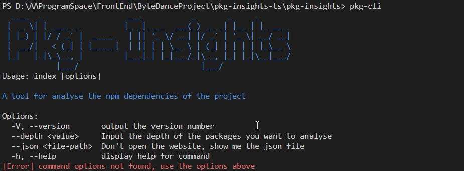
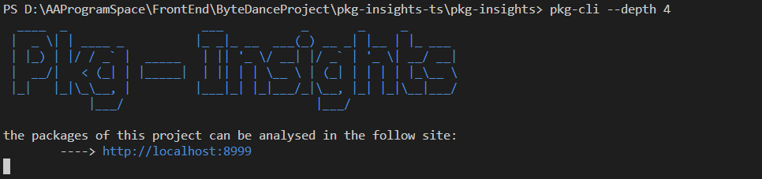

# Pkg-Insights

分析当前项目目录下的`package.json`出发，遍历分析node_modules下的所有依赖包关系的cli工具

**使用方法**

1. 克隆仓库到本地

2. 进入这个项目的根目录，执行以下命令

   ```
   // 安装项目所需依赖
   npm install
   // 安装当前项目到全局
   npm install -g
   ```

3. 使用命令行终端或是VSCode中的terminal进入一个需要分析的前端项目文件目录（**确保当前路径层级中含有package.json文件**）

4. 运行以下命令执行工具

   ```
   // 3为分析依赖包的深度
   pkg-cli --depth 3
   ```

**截图**





